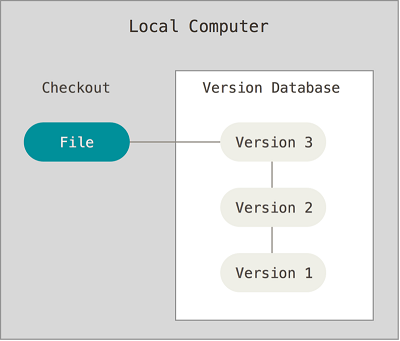

## Control de Versiones

¿Qué es un Control de Versiones?
  
  Es un sistema que registra cambios realizados en un archivo o conjunto de archivos a lo largo del tiempo, de modo que puedas recuperar versiones específicas más adelante.  

### Sistemas de Versiones Locales  

Para afrontar el problema del control de versiones a nivel local, los programadores desarrollaron VCS locales que contenían una simple base de datos, en la que se llevaban el registro de todos los cambios realzados a los registros.

  

### Sistema de Control de Sistema Centralizados

- Desarrollado para darle solucion a los VCS locales, tienen un único servidor que contiene todos los archivos versionados y varios clientes que descargan los archivos desde ese lugar central.
Tiene un problema, necesita colaborar con desarrolladores de otros sistemas. 
- Tiene ventajas con respecto a VCS locales, todas las personas saben hasta cierto punto en qué están trabajando los otros colaboradoes del proyecto.
- Desventaja: dado que es un servidor centralizado, si este servidor cae durante 1 hora, durante esa hora nadie podrá colaborar o guardar cambios en los archivos en los que se esté trabajando.

Cuando se tiene toda el historial del proyecto en un mismo lugar te arriesgas a perderlo todo.

### Sistemas de Control de Sistemas Distribuidos

- Los DVCS (siglas en inglés) ofrecen soluciones para problemas que han sido mencionados (local y centralizado). En los DVCS los clientes descargan la ultima copia instantánea de los archivos, así también replican por completo el repositorio. De esta manera si un servidor deja de funcionar y estos sistemas estaban colaborando a través de el, cualquiera de los repositorios disponib les en los clientes puede ser copiado al servidor con el fin de restaurarlo. Cada clon es realmente una copia completa de todos los datos.

- Estos sistemas se encargan de manejar numerosos repositorios remotos con los cuales pueden trabajar, de tal forma que puedes colaborar simultáneamente con diferentes grupos de personas en distintas maneras dentro del mismo proyecto.

